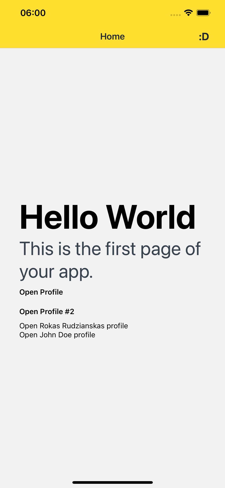

# Expo Router SASS APP building example

App build with expo router, you can use it as a template for your app.

## How to use

- Clone this repo
- Run `npm install` or `yarn install`
- Run `npm start` or `yarn start`
- Open it in the [Expo app](https://expo.io) on your phone to view it.
- Run `npm run web` or `yarn web` to run it in the browser.
- Run `npm run build` or `yarn build` to build it for the web.
- Run `npm run eject` or `yarn eject` to eject from expo.
- Run `npm run android` or `yarn android` to run it on android.
- Run `npm run ios` or `yarn ios` to run it on ios.
- Run `npm run test` or `yarn test` to run tests.
- Run `npm run lint` or `yarn lint` to run lint.
- Run `npm run lint:fix` or `yarn lint:fix` to run lint and fix errors.
- Run `npm run prettier` or `yarn prettier` to run prettier.
- Run `npm run prettier:fix` or `yarn prettier:fix` to run prettier and fix errors.
- Run `npm run storybook` or `yarn storybook` to run storybook.
- Run `npm run storybook:build` or `yarn storybook:build` to build storybook.

## How to add a new screen

- Create a new file in `app` with the name of the screen.

-- Feel free to use it, and modify it as you want.

Deep Linking - npx uri-scheme open exp://192.168.0.113:19000/--/home/messages/123 --ios
Deep Linking - npx uri-scheme open exp://192.168.0.113:19000/--/Your-URL --ios || or --android
